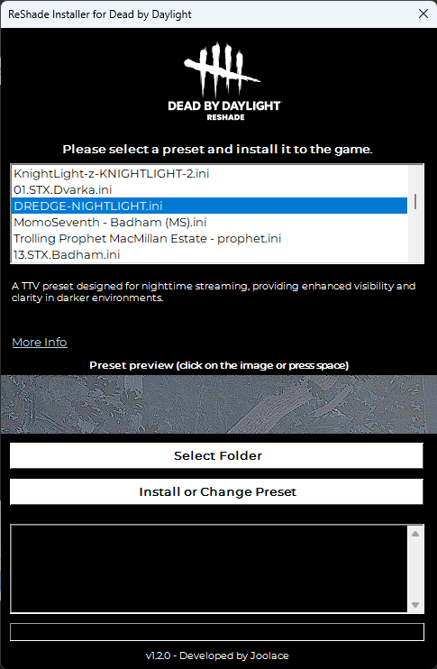
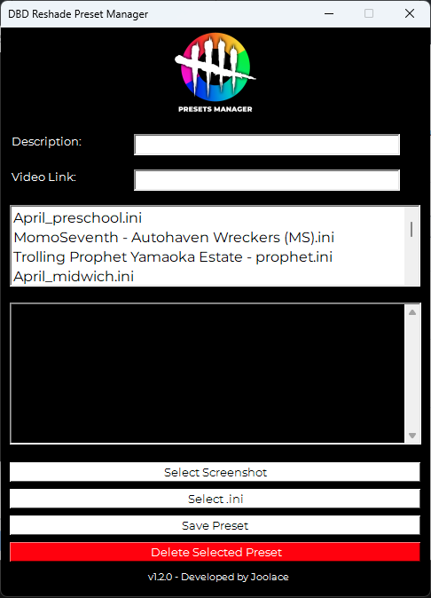
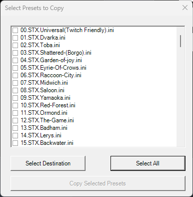

# ReShade Installer for Dead by Daylight


## DBDReshade Launcher
Here you can find the DBDReshade launcher repository. This launcher allows you to install my tool on your Windows 10/11 PC. Requires .NET Framework 4.8 or higher. 
https://github.com/Joolace/DBDReshadeLauncher

## Overview
[](https://app.codacy.com/gh/Joolace/dbd-reshade/dashboard?utm_source=gh&utm_medium=referral&utm_content=&utm_campaign=Badge_grade) [](https://www.codefactor.io/repository/github/joolace/dbd-reshade) [](https://makeapullrequest.com) [](https://github.com/Joolace/dbd-reshade/issues?q=is%3Aissue+is%3Aopen+label%3Abug)

The **ReShade Installer for Dead by Daylight** is a PowerShell script designed to simplify the installation and configuration of ReShade for the game *Dead by Daylight*. This tool automates the process of downloading and installing ReShade, setting up the preset files, and configuring the necessary settings.

## Screenshots

### 1. Main Menu


### 2. DBD Reshade


### 3. DBD Presets Manager


### 4. DBD Copy All Presets


## Features

- **Automatic Detection**: Finds the Dead by Daylight installation directory from both Steam and Epic Games.
- **ReShade Installation**: Downloads and installs ReShade if not already present.
- **Preset Management**: Allows users to select and apply ReShade presets.
- **GUI Interface**: Provides a user-friendly graphical interface for managing presets and installation.
- **Copy All Presets**: Copy the presets you prefer, you can copy all presets or copy the ones you want.

## Requirements

- **PowerShell**: This script is designed to run on PowerShell (Windows only).
- **.NET Framework**: Required for Windows Forms.
- **Dead by Daylight**: The game must be installed either via Steam or Epic Games.

## Installation

### From the Repository

1. **Clone the Repository**:
    ```bash
    git clone https://github.com/Joolace/dbd-reshade.git
    ```

2. **Navigate to the Script Directory**:
    ```bash
    cd dbd-reshade
    ```

3. **Run the Script**:
    Open PowerShell as Administrator and execute the script:
    ```powershell
    .\dbdreshade.ps1
    ```

### From GitHub Releases

1. **Go to the Latest Release**:
   Navigate to the [Releases](https://github.com/Joolace/dbd-reshade/releases) section of the repository and download the latest version.

2. **Download the Zip File**:
   Download the file named `DBDReshade-vX.X.X.zip`.

3. **Extract the Files**:
   Extract the contents of the zip file to a folder of your choice.

4. **Run the Batch File**:
   Open the extracted folder and double-click `OPEN DBD RESHADE.bat`.

Now you can use DBD Reshade!

## Usage

1. **Launch the GUI**: When you run the script, a GUI window will appear.
   
2. **Select a Preset**: Choose a preset from the list in the GUI.

3. **Select Installation Folder**: Click on the "Select Folder" button to choose the destination folder for the preset.

4. **Install or Change Preset**: Click on the "Install or Change Preset" button to apply the selected preset.

5. **Log Output**: The GUI includes a log box to display real-time log information during installation.

## Video tutorial

[](https://www.youtube.com/watch?v=OUUZ9shTAnk)

## Troubleshooting

- **Error Retrieving ReShade URL**: Ensure you have an active internet connection and the URL to ReShade is accessible.
- **ReShade Installation Failure**: Make sure you have sufficient permissions and the game directory is correctly identified.
- **Missing Presets or Media**: Verify that the `presets` and `media` directories are present in the same location as the script.

## Disclaimer

- **Responsibility**: I do not assume any responsibility for bans or other consequences resulting from the use of this tool. Use it at your own risk.
- **False Positives**: The executable file may be flagged as a false positive by some antivirus programs. Ensure that you download the file from the official repository and use it with caution.
- **Size**: From v1.2.0 the size has increased significantly because preset previews have been added. The previews are in 2K (JPG) to show the user how the game will look when using that particular preset at the best quality.

## Credits

A special thanks to the creators of the following presets for *Dead by Daylight*, which are included in this repository:

- **STX**: [steaxss](https://github.com/steaxss/STEAXS-FILTER-PACK)
- **April**: [april](https://www.youtube.com/watch?v=2_YQ_rWiKFE)
- **Aroz**: [Aroz](https://www.youtube.com/watch?v=4TArEDvT_ec&t=30s)
- **Azef**: [azef](https://www.youtube.com/watch?v=FUelIy0sGOk)
- **Faelayis**: [Faelayis](https://github.com/Faelayis/dbd-reshade)
- **Henz**: [Henz](https://discord.com/invite/HxjbEKuvZY)
- **KnightLight**: [KnightLight](https://www.twitch.tv/knightlight)
- **Koda**: [Koda](https://discord.com/invite/bNvWEde5Vr)
- **MomoSeventh**: [MomoSeventh](https://www.twitch.tv/momoseventh/)
- **Trolling Prophets**: [Trolling Prophets](https://discord.com/invite/bNvWEde5Vr)
- **NUGGETZ**: [NUGGETZ](https://www.youtube.com/watch?v=Qs28LJTro70)

Please refer to the respective preset files in the [Presets directory](https://github.com/Joolace/dbd-reshade/tree/main/Presets) for detailed credits and information.

## Contributing

Contributions are welcome! If you have any bug reports, feature requests, or improvements, please open an issue or submit a pull request.

## License

This project is licensed under the GNU General Public License (GPL) - see the [LICENSE](LICENSE) file for details.

## Contact

For any questions or feedback, you can reach out to the developer:

- **Twitch**: [Joolace_](https://twitch.tv/joolace_)
- **GitHub**: [Joolace](https://github.com/Joolace)

## Join Us on Discord

Feel free to join our Discord community for support and discussions:

[](https://discord.gg/RB85R838K9)
